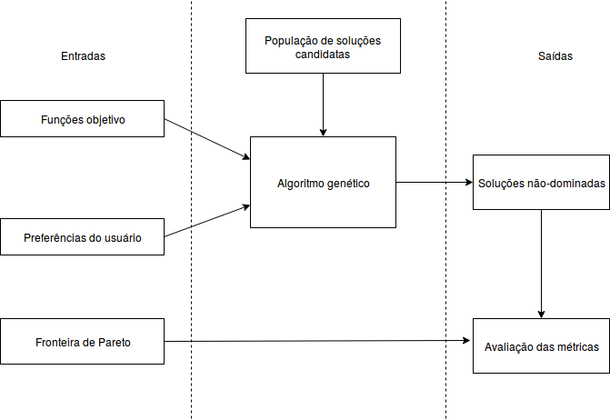

# IA369
Reprodutibilidade em Pesquisa Computacional

### Instruções para reprodução do paper executável

Faça o download deste repositório para um diretório local. Caso possua o Git instalado, você também pode clonar o repositório executando o comando a seguir em um terminal: <br>
```
$ git clone https://github.com/pedro-mariano/IA369.git
```
Há duas opções para instalar as dependências necessárias para reproduzir o paper executável: manualmente ou via Docker. Recomenda-se a instalação via Docker.

## Instalação manual

**1)** Instale os módulos necessários para a execução do paper:

- Python 2.7.16
- Jupyter Notebook 5.7.8 <br>
Ambos podem ser obtidos por meio da instalação do Anaconda, disponível em https://www.anaconda.com/distribution/

- NumPy 1.16.4 (https://www.numpy.org/)
- SciPy 0.19.1 (https://www.scipy.org/install.html)
- Matplotlib 2.2.4 (https://matplotlib.org/users/installing.html)
- PyGMO 2.11 (https://esa.github.io/pagmo2/install.html)
- DEAP 1.2.2 (https://deap.readthedocs.io/en/master/installation.html) <br>
Siga as instruções de instalação disponíveis nas páginas de cada biblioteca, ou caso possua o pip instalado, execute o seguinte comando em um terminal:<br>
```
$ pip install numpy scipy matplotlib pygmo deap
```

**2)** Abra o Jupyter Notebook e execute o arquivo MOMCEDA.ipynb localizado na pasta *deliver/*.

## Instalação via Docker

**1)** Caso não possua o Docker CE instalado, faça o download e instale-o na página da plataforma: https://docs.docker.com/install/

**2)** Navegue até o diretório local onde foi feito o download deste repositório. No Linux, execute o comando:
```
$ cd /home/user/IA369
```
**3)** Execute o comando a seguir para fazer o download da imagem Docker e executar o container:
```
$ docker run -p 8888:8888 pedromarianosb/momceda
```
**4)** Abra um navegador e acesse o endereço http://localhost:8888 para abrir o Jupyter Notebook. Em seguida, abra o arquivo MOMCEDA.ipynb localizado na pasta *deliver/*. 

### Workflow

O workflow do método aqui proposto está representado na figura a seguir. O usuário fornece as funções objetivo que deseja otimizar, bem como as suas preferências que serão utilizadas para classificar soluções candidatas. Além disso, no caso de problemas-teste, a Fronteira de Pareto, que contém as soluções não dominadas do problema, é conhecida e uma amostra de seus pontos também é fornecida para o cálculo de métricas de avaliação do algoritmo. O algoritmo itera sobre uma população de soluções candidatas, inicializada aleatoriamente, cujos indivíduos não-dominados correspondem à saída ao final da execução. Esses indivíduos são utilizados para o cálculo das métricas de avaliação.

<p style="text-align:center;"></p>
